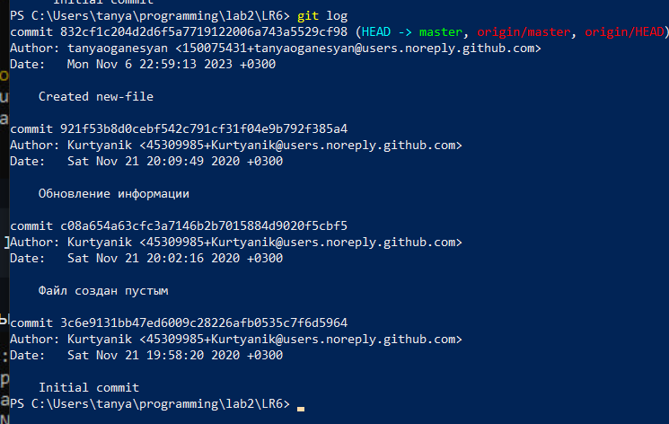

# LR6
Лабораторная работа №6

Цель лабораторной работы: изучение базовых возможностей системы управления версиями, опыт работы с Git API, опыт работы с локальным и удаленным репозиторием.

Выполнение работы

* Сделать fork репозитория на GitHub


* Клонировать свой личный удалённый репозиторий на компьютер.

```bash
git clone https://github.com/tanyaoganesyan/LR6.git
```

 * Добавить файл через интерфейс GitHub. Подтянуть изменения в локальный репозиторий.

```bash
git pull
```

*  Получить историю операций для каждой из веток.

```bash
git log --graph
```

* Просмотреть последние изменения. 

```bash
git log
```

* Выполнить слияние в ветку master, разрешив конфликт.

```bash
git branch test-branch
git checkout test-branch
git add .
git commit -m "file changed in test-branch"
git checkout master
git merge test-branch
```

* Удалить побочную ветку после успешного слияния.

```bash
git branch -d test-branch
```

* Сделать изменения и зафиксировать их, оставляя комментарии ,несколько раз. 

```bash
git add . 
git commit -m "file changed after merging from master"
```

* Сделать откат коммита. 

```bash
git reset --soft HEAD~1
git log
```

* Создать ветку для отчёта.

Поступим по аналогии с действиями в начале работы:
```bash
git branch report
git checkout report
```


* Начать оформлять отчёт.

* Получить историю операций в форматированном виде.

* Отправить локальные изменения в сетевое хранилище GitHub

```bash
git log --pretty=format:"%h %ad %an %s"
```
* Отправить локальные изменения в сетевое хранилище GitHub

```bash
git push -u origin 
```
